# review-helper

Это расширение позволяет очень быстро проверять задания на платформе.

## Установка 

1. Скачать с git актуальную версию 
2. Распаковать
3. В браузере на основе хромиум перейти по адресу:
   1. Яндекс browser://extensions/ 
   2. Хром chrome://extensions/
   3. Вивальди vivaldi:extensions/
   4. Для остальных браузеров на основе хромиум смотрите их документацию

4. Включить режим разработчика для расширений

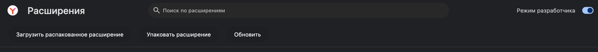
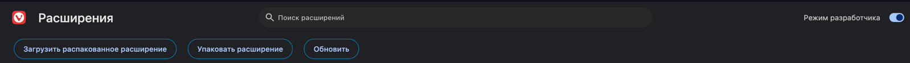

5. Нажать кнопку "Загрузить распакованное расширение"

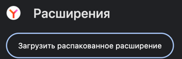
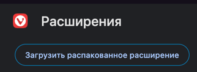

6. Выбрать в проводнике/finder папку с распакованным расширением, нажать кнопку "Выбрать"
7. Должно появится такое расширение

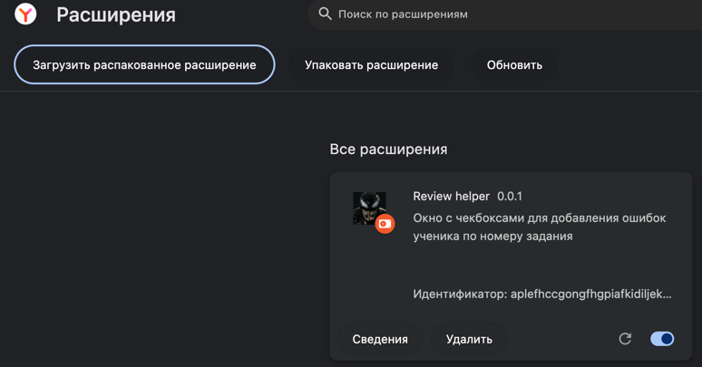

8. Окно расширения автоматически появится при переходе на страницу проверки ревью
9. Радоваться и прочитать пункты "Пример использования"

## Главное окно

Главное окно расширения можно свободно перемещать. Для этого достаточно захватить его за надпись **"Ошибки"**.

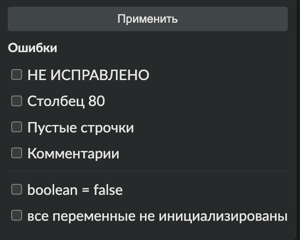


### Пример использования

1. **Открытие окна проверки:**  
   Откройте окно проверки студента и разместите его так, как вам удобно.  
   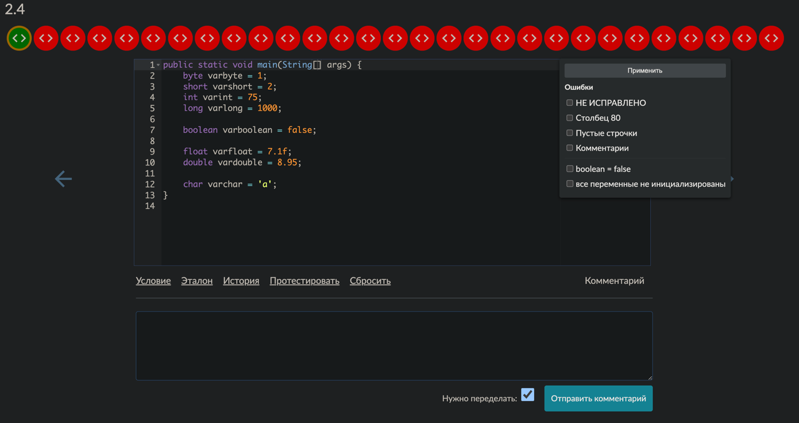

2. **Выбор ошибок:**  
   Согласно принятым стандартам (внутреннему перфицианисту/похуисту), отметьте ошибки, допущенные студентом, щелкнув по соответствующим пунктам.  
   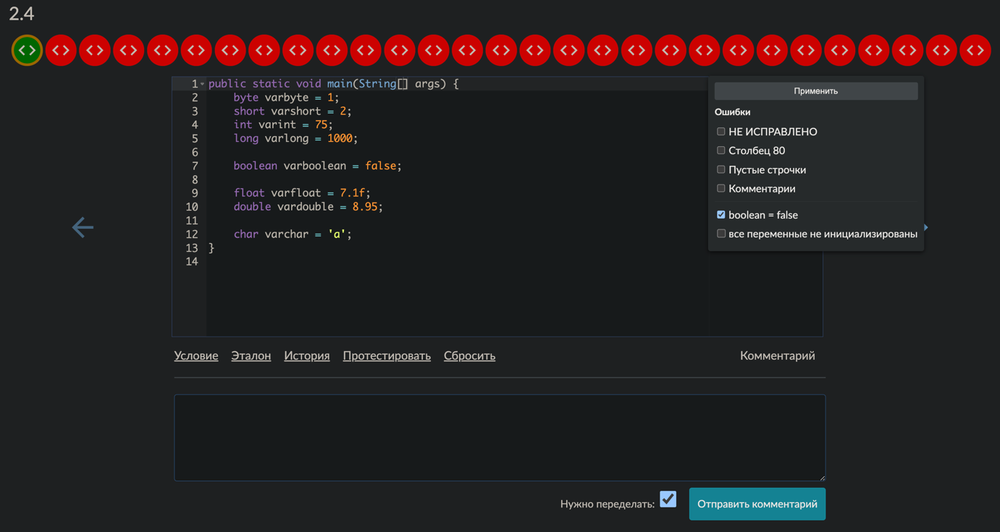

3. **Применение выбранных ошибок:**  
   Убедившись в правильности выбранных пунктов, нажмите кнопку **"Применить"**. После этого автоматически сформируется текст, в котором каждая ошибка будет обозначена с префиксом **"#"**.

4. **Автоматическая вставка комментария:**  
   Сформированный текст автоматически вставится в поле ввода **"Комментарий ментора:"**. Затем активируется кнопка **"Отправить комментарий"**, и окно проверки перейдет к следующему заданию.  
   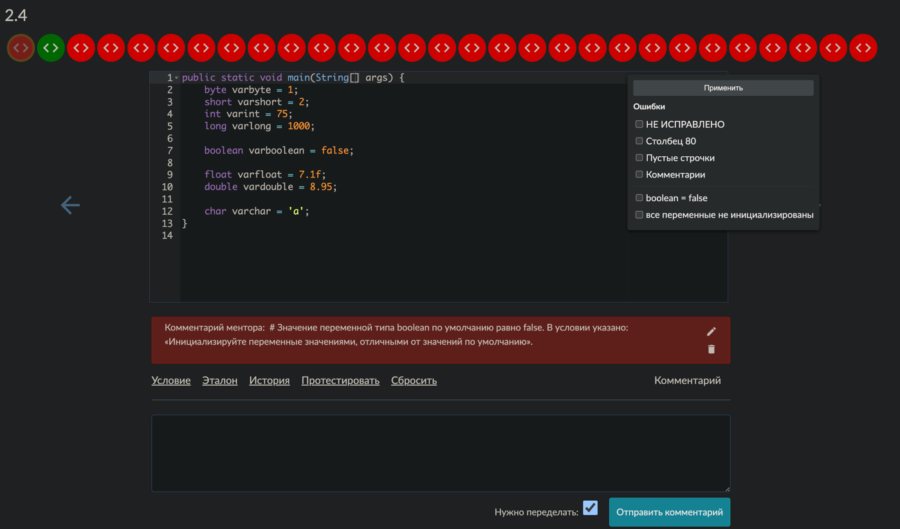  
   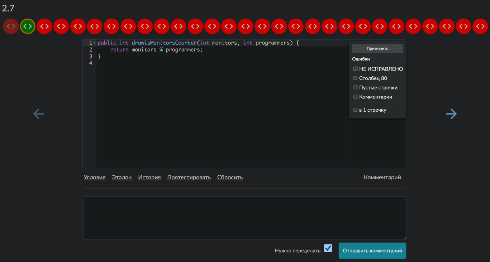

5. **Переход к следующему студенту:**  
   После проверки всех заданий перейдите к следующему студенту и повторите шаги 1–4.

## Модификация чекбоксов 

### Прошу ответственно относится к модификации данных чекбоксов!!!

Вся текстовая информация хранится в файле errors.js, для абстракции от кода основного приложения

Есть два вида списков
- Перманентные `window.commonErrors`
- Зависящие от вопроса `window.taskErrors`

`window.commonErrors` будут всегда висеть в списке чекбоксов независимо от задания, он должен быть не большой и содержать только самые распространение ошибки во избежание его раздувание, несколько раз подумать, нужно его выносить в перманентные или стоит для 5-6 заданий прописать где он действительно требуется

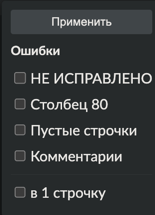

`window.taskErrors` привязываются к конкретному заданию

Задание 1.2.4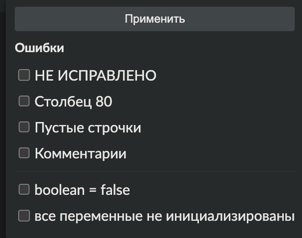

Задание 1.2.7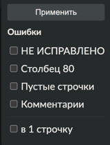

На скриншотах видно, что в зависимости от выбранного задания, подбираются вопросы привязанные к номеру текущего активного задания

### Модификация `window.commonErrors`

window.commonErrors = [... ...] - названия массива, где каждый его элемент это новый чекбокс

Для добавления нового чекбокса, нужно добавить новый элемент в массив
`{ id: "commonErrors1", label: "НЕ ИСПРАВЛЕНО", text: "ЗАДАНИЕ НЕ ИСПРАВЛЕНО" },`
где `id` - требуется для отличия от других, пишем по аналогии commonErrors2, commonErrors3 и т.д.

`label` - что мы видим в плавающем окне расширения  - должен супер кратко и супер понятно отражать ошибку во избежания путаницы

`text` - текст рекомендации ментора, текст должен начинаться с символа # для читаймости между текстами рекомендации   

### Модификация `window.taskErrors`

`window.taskErrors` - делится на 6 модулей, по аналогии с 6 модулями на платформе
В `window.taskErrors = {` элемент `"Текст модуля": {}` внутри этого модуля добавляем элементы как и в `window.commonErrors`, но с отличием в генерации id, id состоит с следующих значений 

`err_1_2_7_A`
   `err` означает что это текст рекомендации
   `1` указываем что это рекомендация относится к первому модулю
   `2_7` текстовый номер задания
   `A` буквенное обозначение номера для конкретного задания продлжить по аналогии A, B, С, D и т.д.

```javascript
window.taskErrors = {
    "Проверка кодовых задач. Модуль: Введение в Java и базовый синтаксис": { // текстовое название модуля
        "2.4": [ // текстовый номер задания
            // сами чексбоксы, модифицировать по аналогии с window.commonErrors
            {
                id: "err_1.2.4_A",
                label: "boolean = false",
                text: "# Значение переменной типа boolean по умолчанию равно false. В условии указано: «Инициализируйте переменные значениями, отличными от значений по умолчанию»."
            },
            {
                id: "err_1.2.4_B",
                label: "все переменные не инициализированы",
                text: "# В условии указано: «Инициализируйте переменные значениями, отличными от значений по умолчанию»."
            }

        ],
        "2.7": [
            {id: "err_1_2_7_A", label: "в 1 строчку", text: "# Данное задание нужно выполнить в 1 строчку"},
        ],
    }
}
```


### При добавление или изменения вопросов и пуша на github, изменить версию расширения в manifest.json 0.0.1 -> 0.0.2 и так далее поп аналогии
